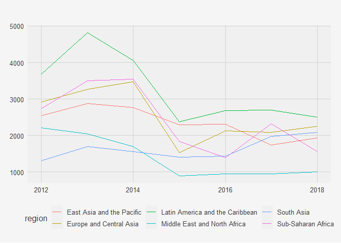
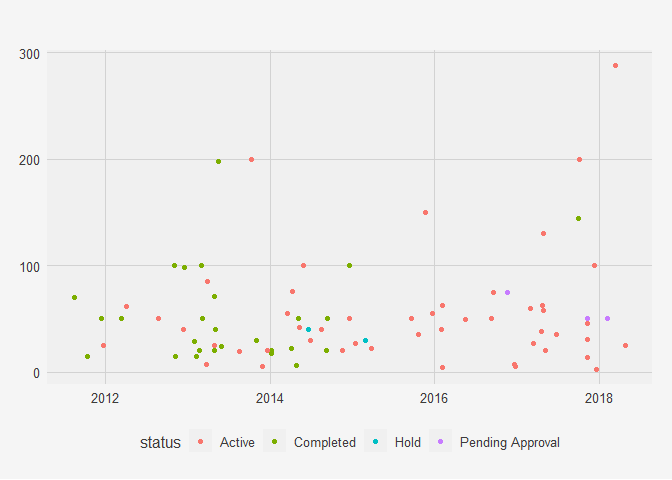
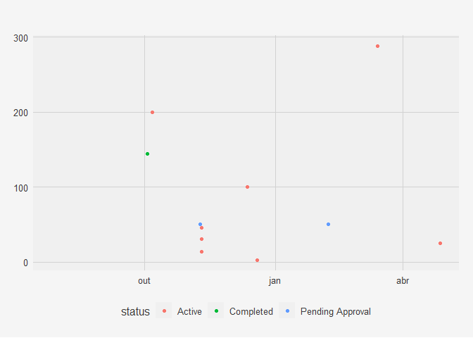
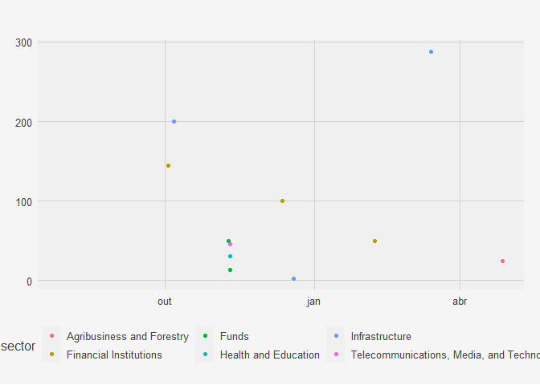

# Datasets 

## Investment Annual Summary
The `investment_annual_summary` dataset provides a summary of the dollars in millions provided to each region for each fiscal year, from 2012 to 2018.

1. East Asia and the Pacific      
2. Europe and Central Asia        
3. Latin America and the Caribbean
4. Middle East and North Africa   
5. South Asia                     
6. Sub-Saharan Africa

Table: Table 1.1 The total investment summary for each region for the 2012 to 2018 fiscal years.

             Region                 Dollars in Millions 
---------------------------------  ---------------------
    East Asia and the Pacific              16465        
     Europe and Central Asia               17659        
 Latin America and the Caribbean           22828        
  Middle East and North Africa             9755         
           South Asia                      11459        
       Sub-Saharan Africa                  16892        

## Investment Projects in Brazil

The `investment_services_projects` dataset provides information about each investment project from 2012 to 2018. Information listed includes the project name, company name, sector, project status, and investment amounts. Projects that do not have an associated investment amount are excluded from the plot.

## Investment Projects in Brazil in 2018

The `investment_services_projects` dataset was filtered below to focus on information about each investment project from the 2018 fiscal year, and is referred to as `country_annual_investment_projects`. Projects that do not have an associated investment amount are excluded from the plot.

## Investment Projects in Brazil by Sector

